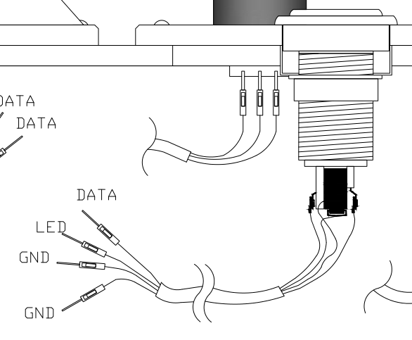
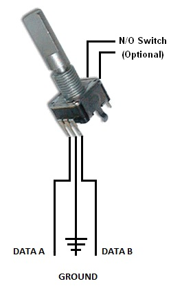

# Hybrid IIDX-SDVX Controller (DIY)

Last update: February 24th 2017
Note:
I am no longer supporting this as a Hybrid Controller because it was way too complicated to put everything inside the box. So, as of now there will be no more updates to this tutorial.

Instead I did a copy of this and made a DIY IIDX Controller only (No Hybrid).
You can check it out here:

# Other Projects:

1. [Sound Voltex PC Controller, using a Teensy 3.2 PCB](/rhythmcons/sound-voltex/sdvx-normal)
2. [IIDX Beatmania PC Controller, using a Leonardo Arduino](/rhythmcons/beatmania-iidx/iidx-small/)
3. [Sound Voltex Minicon for $90](/rhythmcons/sound-voltex/sdvx-minicon)

This how-to is based on two other instructions on how to make a DIY controller using an Arduino PCB. Many thanks to:

- [LEONARDOjoy](https://sdvxdiy.github.io/) 
For the style and useful info regarding the Leonardo PCB

- [Original Hybrid IIDX-SDVX instructions, by 4yn](https://github.com/4yn/iivx) 
For the original code and the original sketch for the acrylic base.

At the end of this tutorial you'll know how to make a Beatmania IIDX Controller + Soundvoltex keypad, and what you need to make one.

# Index

1. Why?
2. Variations
3. Code
4. Parts List / Hardware
5. Parts List / Building Materials
6. Software & Wiring
7. Asembly /Building the controller
8. Gallery

## Why would you do this? (A.K.A. the part you can skip)

Where I come from we have just a few options to play Beatmania:

- 1 or 2 arcades without E-Amusement support
- Buying the japanese or american KOC for $100+ US Dollars locally 
- Importing a DJDAO FPS form gamo2.com for $199 + $100 shipping
- Importing any other controller from EBAY or such.
- Doing your own controller, importing all the smaller stuff.

So basically this instructions cover the last option.

Following these instructions you will end up with a controller that works on PC, and that'll cost you about 100 total in the cheapest version (even cheaper if you use cardboard, I'd say 60), or even 200+ if you go for Sanwa buttons and Omron switches.

## Variations

The code and CAD files included will let you make a DJDAO-size controller with interchangeable button plates, using an Arduino Leonardo to wire everything up.

Included in this tutorial you can choose from 2 variations:
 
- Beatmania IIDX Controller (9 buttons + Turntable + 9 LEDs)

  

- Beatmania IIDX+SDVX Controller (9 buttons + Turntable + 2 Knobs + 5 LEDs) 

  

You can either build just one of them or build both.
But you'd have to change the code everytime you change the button keypad layout.

Due to the number of pins it's imposible to have 3 encoders, 9 buttons and also have 9 LED's, so you either use me code (with only 5 LED's) or modify it to remove 1 encoder for 2 more LED's.

 

## Code

Initial code here

https://github.com/lizardbeans/iidxsdvx

It has the untested code for the IIDX only layout.

## Part List / Hardware

Most of these links are from chinese webpages that give world-wide free shipping (if you can wait 2 months). Buying locally is also a good option.

### Arduino

  

[Arduino Leonardo **$10** Chinese shop](http://www.dx.com/p/diy-leonardo-r3-module-for-arduino-works-with-official-arduino-boards-blue-376823#.WH4Ie_nhAVA)
Chinese knock-off works just fine.

[Arduino Leonardo **$12** US Seller](http://www.ebay.com/itm/Leonardo-R3-development-board-Board-USB-Cable-compatible-for-arduino-/131785751446?hash=item1eaf0afb96:g:gA4AAOSwAoRXFW1g)

### Encoders

  

[High Quality rotary Encoders (600ppm) **$10**](https://www.aliexpress.com/wholesale?catId=0&initiative_id=SB_20170718095552&SearchText=encoder+600)
This one is for the turntable. Alternatively you can use optical encoders, but those are not included in the code, nor do I know how to use them.

 

[Low Quality Encoders (24ppm) **$0.70**](https://es.aliexpress.com/item/1pcs-Rotary-encoder-code-switch-EC11-audio-digital-potentiometer-with-switch-5Pin-handle-length-20mm/32655246773.html?spm=2114.13010608.0.0.3phRJQ)
You'll need 2 of these for both knobs. Alternatively you can use 2 High Quality encoders for the knobs, but I found that the cheap ones works just fine. Using 3 high quality encoders would need a new code anyway.

### Knobs

  

Option 1 (recomendable): [25x22 aluminium knobs **$7.20 each**](https://es.aliexpress.com/item/Machined-Solid-Aluminum-Volume-Control-Set-Potentiometer-knob-HIFI-Car-Audio-Tube-amplifier-Headphone-AMP-DIY/32346083222.html?spm=2114.13010608.0.0.3phRJQ)
The hybrid controller is smaller than a arcade SDVX controller, so it's a little better to have thinner knobs.

Option 2 (Arcade size): [30x22 aluminium knobs **$5 each**](http://www.ebay.com/itm/1PCS-30mmDIAx22-Aluminum-STEREO-VOLUME-CONTROL-KNOB-/380905947186?pt=LH_DefaultDomain_0&hash=item58afc38032) 

  

Option 3 [Cheap-o small knobs **$1.70 each**](http://www.dx.com/p/jtron-volume-knob-aluminum-knob-potentiometer-knob-cap-silver-297005)
Check the Gallery, these are really cheap aluminium knobs, but they do the job.

### Buttons

We need 15 Beatmania buttons + 2 start buttons for the full setup, or just 9 beatmania buttons + 2 start buttons if you don't mind changing the buttons between keypads.

[Chinese Beatmania button pack 7 (50x33) + 2 (33x33)+ LED + Microswitch **$30**](https://es.aliexpress.com/store/product/9x-Arcade-Beatmania-IIDX-DIY-Kit-Parts-LED-Light-Illuminated-Rectangular-Buttons/821292_32654141915.html) 

[Chinese Beatmania button pack 10 pcs. + LEDS + Microswitch **$29**](https://es.aliexpress.com/item/10x-Beatmania-IIDX-Rectangle-LED-Light-Illuminated-Push-Button-Rectangular-buttons-For-Arcade-Coin-Machine-50/32720629306.html?spm=2114.13010608.0.0.3phRJQ)

[Chinese Start Button 33x33 **$2**](https://es.aliexpress.com/item/Free-shipping-Factory-price-33mm-square-game-machine-push-button-arcade-LED-momentary-push-button-illuminated/32731502532.html?spm=2114.13010608.0.0.3phRJQ)

[Sanwa Original Arcade 50x33 button **$12 each**](http://global.rakuten.com/en/store/sanwadenshi/item/ilumb_100/?s-id=borderless_recommend_item_en)

### Microswitch

Here you can go full cheap using the included microswitches that come with the buttons, or go full Arcade Style with Omron microswitches.

[Cheap Chinese Microswitch 10 pcs. **$8**](https://es.aliexpress.com/store/product/Free-Shipping-10pcs-Microswitch-Sensitive-Switches-Push-Button-Switches-16A-250VAC-5E4-KW7-02-CE-CQC/1759035_32733952931.html?spm=2114.30011108.3.213.DUTqmP&ws_ab_test=searchweb0_0,searchweb201602_6_10065_10068_10000009_10084_10000025_10083_10080_10000029_10082_10081_10000028_10110_10111_10060_10112_10113_10062_10114_10115_10056_10055_10037_10054_10059_10032_10099_10078_10079_10000022_10077_10000012_10103_10073_10102_10000015_10096_10000018_10000019_10052_10053_10107_10050_10106_10051,searchweb201603_9,afswitch_4_afChannel,single_sort_2_default&btsid=67520e96-47af-4dcc-99c7-4b7d0847a0cd)

[Omron D2MV-01-1C3 (50gr.) (10 pcs.)**$75** Ebay](http://www.ebay.com/itm/262495416199)

[Omron D2MV-01-1C3 (50gr.) **$3 each** Rakuten Global](http://global.rakuten.com/en/store/sanwadenshi/item/ilumb_223/)

**FYI:**
D2MV-01-1C1 = 10g. pressure
D2MV-01-1C2 = 25g. pressure
D2MV-01-1C3 = 50g. pressure

Original Arcade Feel = 100g spring + 50g microswitch

### Misc

[Jumper Wires **$9**](http://www.dx.com/p/pvc-male-to-female-arduino-dupont-cables-multicolored-30cm-307052#.WH4I3_nhAVA)
Jumper wires are cheap and you can buy them locally or in china, and will make this work 200% easier. 40 cm long male-female jumper wires are ok, you'll need one for each conection, so it'll be 4 per button (36 total) and 3 per encoder (6 total).

  

[Crimp conectors 50 pcs. **$5**](http://www.dx.com/p/6-3mm-female-spade-crimp-terminal-connector-set-w-waterproof-covers-silver-50-pcs-202529#.WH4I_PnhAVA)
Solder these to the jumper cables to make it easier to change microswitches if they fail.You can also buy them on your local hardware store.

[Protobar / Breadboard 400pin **$2.20**](http://www.dx.com/p/solderless-breadboard-with-400-tie-point-white-121534#.WH4I__nhAVA)
You will need this.

## Part List / Building Materials

Most of these parts should be CNC cut or laser cut (which is a little expensive). You can also use a cardboard box or wood planks.
I used clear acrylic because it's cheaper, also using only one thickness will make it even less expensive.

  
  
**Main mounting plate**
* 3 or 5mm Black/Clear Acrylic with holes for button pad and disc encoder, also screw holes. I used 5mm clear acrylic, but I found out it's better to use 3mm black acrylic fr the DJDAO FPS look.

  
  
**Button pads**
* 5mm Black/Clear acrylic with holes for buttons and encoders. Black looks way better, I used clear.

  
  
**Turntable mounting plate**
* 5mm Clear acrylic with holes for encoder and screws.

  
  
**Turntable base**
* 10mm (or 2x5mm) round discs with holes for encoder and mounting screws. Use this base to bring your turntable to your desirable height.

  
  
**Turntable disc**
* 3mm or 5mm round disc with hole to fit the encoder. You can also cover this with a rubber skin for maximum gripness. The acrylic itself is really slippery.

**Mounting Box**
* I used 9-12mm MDF for the box walls, 5,5mm MDF for the base and 3mm MDF for the back door. Every cut and hole was made by me with a saw and some sandpaper. Using an electric saw and a sandpaper machine is a lot easier.

I used what was available on the store, but on a next revision I'd go for 9mm walls, 3mm base and 3mm door, posibly made of acrylic.

 

You can find the CAD file in the github code page. (coming soon)

## Software and Wiring

The wiring process is really simple using the stuff I told you to buy.
The crimp conectors, the jumper wires and the breadboard will come in handy when you have to mount all up.

First let's talk about microswitches.

Microswitches can have 2 or 3 contacts depending if they're chinese or Omron brand switches.
The first one usually have 3 contacts: the one from bellow it's the ground (GND) and the lower right one is the input. The third one on the upper right it's always closed, we won't use it. Omron switches come only with the lower and lower right contacts. Check out this diagram:

You can daisy-chain all the grounds in a single wire like this diagram:
>Thanks to LEONARDOjoy tutorial for this image.

But what I'm doing is have a single wire that has both the Input pin and the LED pin, with one common ground. The three wires then go to the breadboard.

That way you'll have one single wire coming from a single button, instead of a single wire connected to every button (which is kind of messy)

Then we have the **encoders**.

This is how you wire the cheap ones (24ppr)

You'll end up with a single wire like this:

And for the high quality encoders (600ppr) you should wire it like this:

These encoders nees a 5v input from the PCB. The Leaonardo PCB has a 5v output (marked as 5v pin) so that's where you should plug that wire.

**PIN DIAGRAM**

The pins are assigned to every button and encoder. You'll see that the PCB has many pins from A0 to A5, and from 0 to 13, so you'll have 19 pins in total. Remember that buttons use one pin, but encoders will use 2 pins for the cheap ones and 3 pins for the high quality (Pending revision). The PCB also has 3 grounds (GND) to choose from.

This table shows configuration for both keypad layouts.

**Hybrid IIDX-SDVX Layout**

(revision pending)

<table><thead>
<tr>
<th>Button</th>
<th style="text-align: center">Pin #</th>
<th style="text-align: center">Button #</th>
<th style="text-align: center">LED Pin #</th>
</tr>
</thead><tbody>
<tr>
<td>FxR</td>
<td style="text-align: center">11</td>
<td style="text-align: center">Button 8</td>
<td style="text-align: center">no LED</td>
</tr>
<tr>
<td>FxL</td>
<td style="text-align: center">12</td>
<td style="text-align: center">Button 9</td>
<td style="text-align: center">no LED</td>
</tr>
<tr>
<td>BT-A</td>
<td style="text-align: center">13</td>
<td style="text-align: center">Button 7</td>
<td style="text-align: center">6</td>
</tr>
<tr>
<td>BT-B</td>
<td style="text-align: center">A0</td>
<td style="text-align: center">Button 5</td>
<td style="text-align: center">7</td>
</tr>
<tr>
<td>BT-C</td>
<td style="text-align: center">A1</td>
<td style="text-align: center">Button 3</td>
<td style="text-align: center">8</td>
</tr>
<tr>
<td>BT-D</td>
<td style="text-align: center">A2</td>
<td style="text-align: center">Button 1</td>
<td style="text-align: center">9</td>
</tr>
<tr>
<td>Start</td>
<td style="text-align: center">A3</td>
<td style="text-align: center">Button 4</td>
<td style="text-align: center">10</td>
</tr>
<tr>
<td>Button 6</td>
<td style="text-align: center">A4</td>
<td style="text-align: center">Button 6</td>
<td style="text-align: center">no LED</td>
</tr>
<tr>
<td>Button 2</td>
<td style="text-align: center">A5</td>
<td style="text-align: center">Button 2</td>
<td style="text-align: center">no LED</td>
</tr>
</tbody></table>

BUtton 2 and 6 are not used in SoundVoltex unless you want to use them as the Service button and Test button (which I don't recommend)

<table><thead>
<tr>
<th>ENCODERS</th>
<th style="text-align: center">DATA 1</th>
<th style="text-align: center">DATA 2</th>
</tr>
</thead><tbody>
<tr>
<td>Encoder Right</td>
<td style="text-align: center">0</td>
<td style="text-align: center">1</td>
</tr>
<tr>
<td>Encoder Left</td>
<td style="text-align: center">2</td>
<td style="text-align: center">3</td>
</tr>
<tr>
<td>Encoder Turntable</td>
<td style="text-align: center">4</td>
<td style="text-align: center">5</td>
</tr>
</tbody></table>

That leaves pin 6 to 10 for LEDS (5 buttons)

**Beatmania IIDX only Layout**

<table><thead>
<tr>
<th>Button</th>
<th style="text-align: center">Pin #</th>
<th style="text-align: center">Button #</th>
<th style="text-align: center">LED Pin #</th>
</tr>
</thead><tbody>
<tr>
<td>Start</td>
<td style="text-align: center">11</td>
<td style="text-align: center">Button 8</td>
<td style="text-align: center">2</td>
</tr>
<tr>
<td>VFX</td>
<td style="text-align: center">12</td>
<td style="text-align: center">Button 9</td>
<td style="text-align: center">3</td>
</tr>
<tr>
<td>Button 1</td>
<td style="text-align: center">13</td>
<td style="text-align: center">Button 1</td>
<td style="text-align: center">4</td>
</tr>
<tr>
<td>Button 2</td>
<td style="text-align: center">A0</td>
<td style="text-align: center">Button 2</td>
<td style="text-align: center">5</td>
</tr>
<tr>
<td>Button 3</td>
<td style="text-align: center">A1</td>
<td style="text-align: center">Button 3</td>
<td style="text-align: center">6</td>
</tr>
<tr>
<td>Button 4</td>
<td style="text-align: center">A2</td>
<td style="text-align: center">Button 4</td>
<td style="text-align: center">7</td>
</tr>
<tr>
<td>Button 5</td>
<td style="text-align: center">A3</td>
<td style="text-align: center">Button 5</td>
<td style="text-align: center">8</td>
</tr>
<tr>
<td>Button 6</td>
<td style="text-align: center">A4</td>
<td style="text-align: center">Button 6</td>
<td style="text-align: center">9</td>
</tr>
<tr>
<td>Button 7</td>
<td style="text-align: center">A5</td>
<td style="text-align: center">Button 7</td>
<td style="text-align: center">10</td>
</tr>
</tbody></table>

<table><thead>
<tr>
<th>ENCODERS</th>
<th style="text-align: center">DATA 1</th>
<th style="text-align: center">DATA 2</th>
</tr>
</thead><tbody>
<tr>
<td>Encoder Tuntable</td>
<td style="text-align: center">0</td>
<td style="text-align: center">1</td>
</tr>
</tbody></table>

That leaves pins 2 to 10 for LEDS (9 LEDS, enough for each button)

## Assembly / Building the controller

1. Take the keypad of your choose. In this case I'll be using the IIDX&SDVX hybrid keypad
2. Prepare buttons with the ammount of pressure you like (button + spring + led + microswitch)
3. Insert every button where it belongs and screw the plastic nut from bellow
4. Insert both cheap encoders and screw the nut from above.
5. Mount the disc mounting plate on the Main mounting plate with the screws.
6. Mount the disc base on top of the Disc mounting plate with screws.
7. Mount th ehigh quality encoder in it's place with 3 screws.
8. Turn around the main mounting plate and mount the Leonardo and Protoboard/Breadboard
9. Wire every pin on the Leonardo PCB with a pin on the Breadboard using jumper wires.
10. Also wire one Ground to the PCB.
11. Mount the keypad plate on the Main plate with screws.
12. Wire every button and LED with the breadboard using jumper wires.
13. Connect the PCB to the computer using a USB cable, and using Arduino IDE load the code into the Arduino Leonardo.
14. Finally mount the plate onto the mounting box and mount the disc on the high quality encoder.

If everything went right there should be a new Arduino controller on your pc.
Buttons 1 to 9 are the main buttons, and X and Y axis are both encoders.

## Gallery

[Check out these awesome pictures!](http://imgur.com/a/Vh7uL)

## Troubleshooting

**How do I insert the code into the Leonardo?**
* Donwload Arduino IDE (version 1.6.5), then connect your board to your pc.

**How do I literally insert THE code into the Leonardo??**
* Inside the code folders there is a .ino file (leovx.ino, loevxhq.ino). Double click it and it'll open Arduino IDE. Connect your Arduino to your PC and click UPLOAD (arrow pointing to the right), and you're done.

**Multiple errors with scary red font when I try to UPLOAD the code**
* Inside Arduino IDE click *Tools*, then *Board:* and choose *Arduino Leonardo*

**Still multiple errors, please?**
* It depends on the situation and the error, I can't help you with that.

**LED's are not turning on**
* Be sure the LED is in the right position. Try taking it out and inserting it again rotating it 180°.

**Button/Turntable is not working**
* Each button needs to be connected to it's pin and to the ground (GND). If it's not connected to any GND pin it won't work. 

**Turntable is wonky and it'll skip frequently**
* Adjunt the sensibility of your encoder inside the code, the instructions are inside the file.

